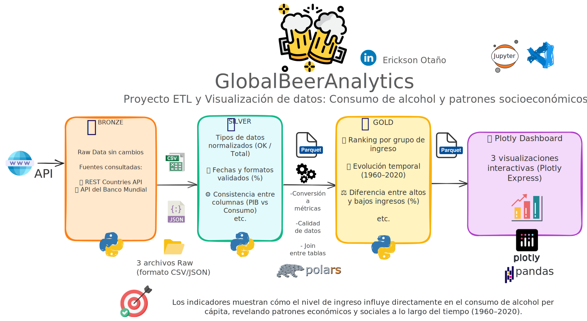

# 🍺 Global Beer Analytics – Proyecto ETL y Visualización de Datos

<p align="center">
  
</p>


> **Proyecto abierto de ingeniería de datos** desarrollado con **Python, Polars y Plotly**,
> para analizar el consumo global de alcohol y su relación con el PIB y los niveles de ingreso (1960–2020).
> Construido paso a paso siguiendo la arquitectura **Medallion (Bronce → Plata → Oro)**.

---

## 🚀 Descripción general

**GlobalBeerAnalytics** es un proyecto ETL de punta a punta diseñado para:

* Practicar la construcción de **pipelines reales de ingeniería de datos**.
* Aplicar **limpieza, validación, enriquecimiento y visualización de datos**.
* Obtener **insights socioeconómicos** sobre el consumo global de bebidas alcohólicas.

Los datos provienen de **Our World in Data (OWID)** y de las **APIs abiertas del Banco Mundial**,
cubriendo más de 200 países a lo largo de 60 años de historia.

---

## 🧱 Arquitectura del Proyecto – Modelo Medallion

```
Datos Crudos (OWID, Banco Mundial)
        ↓
🥑 Bronce → Archivos CSV crudos (cerveza, destilados, total)
        ↓
🥈 Plata  → Datos limpios, normalizados y enriquecidos (PIB, regiones, niveles de ingreso)
        ↓
🥇 Oro    → Tablas analíticas y visualizaciones interactivas
```

### 🧩 Tecnologías utilizadas

| Capa              | Herramientas / Librerías       | Descripción                                                            |
| ----------------- | ------------------------------ | ---------------------------------------------------------------------- |
| 🥑 Bronce         | `requests`, `pandas`, `json`   | Descarga y almacenamiento de datos desde OWID y APIs del Banco Mundial |
| 🥈 Plata          | `polars`, `pyarrow`            | Limpieza, normalización y control de calidad de los datos              |
| 🥇 Oro            | `plotly.express`, `matplotlib` | Análisis visual e interactividad                                       |
| 🧮 Utilidades     | `python-dotenv`, `glob`, `os`  | Automatización y manejo de archivos                                    |
| ☁️ Almacenamiento | Archivos Parquet locales       | Almacenamiento columnar optimizado para análisis                       |

---

## ⚙️ Instalación y configuración

### 1️⃣ Clonar el repositorio

```bash
git clone https://github.com/ericksootano/GlobalBeerAnalytics.git
cd GlobalBeerAnalytics
```

### 2️⃣ Crear y activar entorno virtual

```bash
python -m venv .venv
source .venv/bin/activate  # En Windows: .venv\Scripts\activate
```

### 3️⃣ Instalar dependencias

```bash
pip install -r requirements.txt
```

### 4️⃣ Ejecutar el pipeline ETL

Ejecutar los notebooks en orden:

```
notebooks/
 ├── 01_Bronze_Ingesta_Datos.ipynb
 ├── 02_Silver_Limpieza_y_Calidad.ipynb
 ├── 03_Silver_Enriquecimiento.ipynb
 └── 04_Gold_Analisis_y_Visualizacion.ipynb
```

---

## 🧮 Resumen del pipeline

### 🥑 Capa Bronce

* Descarga de datos crudos de consumo (cerveza, destilados, total).
* Se almacenan en `../data/bronze/*.csv` sin modificar.

### 🥈 Capa Plata

* Limpieza, normalización y auditoría de calidad con **Polars**.
* Creación del log de calidad `data_quality_log.parquet` con:

  * Total de registros, nulos eliminados, valores negativos corregidos y porcentaje de calidad.
* Enriquecimiento con **PIB per cápita** y **clasificación por región e ingreso del Banco Mundial**.

### 🥇 Capa Oro

* Generación de tablas analíticas en `/data/gold/`.
* Creación de visualizaciones interactivas con **Plotly**:

  * Tendencias globales por tipo de bebida.
  * Consumo promedio por región y grupo de ingreso.
  * Top 10 países con mayor consumo.
  * **Gráfico animado (PIB vs consumo de alcohol, 1960–2020)**.

---

## 📊 Principales hallazgos

### 🌍 Tendencia global

* Las bebidas alcohólicas muestran un aumento sostenido entre 1960 y 2000.
* A partir de 2010, la tendencia global tiende a estabilizarse.

### 💰 Grupos de ingreso

* Los países de **altos ingresos** presentan el mayor consumo per cápita.
* Los grupos de ingresos medios y bajos mantienen un crecimiento leve.

### 🌐 Regiones

* **Europa y Norteamérica** dominan el consumo global.
* **Asia y África** muestran crecimiento, aunque con alta variabilidad.

### ⚖️ Relación PIB–Consumo

* Existe una **correlación positiva** entre el desarrollo económico y el consumo de alcohol.
* Sin embargo, factores culturales y religiosos afectan esta relación en ciertas regiones.

### 📈 Anomalías y observaciones

* Se detectaron valores negativos (por redondeo) corregidos en la capa Plata.
* Algunos países clasificados como *“Not classified”* carecen de datos completos del Banco Mundial.

---

## 🧠 Conclusiones

1. Se construyó exitosamente un pipeline **ETL modular, trazable y reproducible** usando Python y Polars.
2. La **arquitectura Medallion** permite segmentar el ciclo de vida de los datos de forma clara.
3. La combinación de **indicadores económicos y de consumo** ofrece perspectivas sociales valiosas.
4. Se logra **data storytelling** mediante visualizaciones interactivas y dinámicas.

---

## 🧳 Limitaciones y próximos pasos

* Falta de información completa para algunos países y años.
* Posible integración futura con **Databricks** o **Power BI** para análisis a gran escala.
* Automatización del pipeline con **Airflow** o **Prefect**.
* Implementar pruebas unitarias y CI/CD para validación continua.

---

## 🎥 Visualización interactiva

> **Explora la animación interactiva de la relación entre PIB per cápita y consumo de alcohol:**
> 🎮 [Abrir visualización (HTML)](data/gold/plots/pib_vs_consumo.html)

---

## 🧮 Estructura del proyecto

```
GlobalBeerAnalytics/
│
├── data/
│   ├── bronze/                  # Datos crudos descargados
│   ├── silver/                  # Datos limpios y enriquecidos
│   └── gold/                    # Resultados analíticos y gráficos
│
├── notebooks/
│   └── GlobalBeerAnalytics_ETL.ipynb
│
├── data/gold/plots/pib_vs_consumo.html
├── requirements.txt
├── README.md
└── .gitignore
```

---

## 🗂️ Diccionario de datos – Tabla final (Silver enriquecida / base Gold)

**Archivo:** `data/silver/alcohol_consumption_enriched.parquet`
**Uso:** insumo directo para todas las tablas y visualizaciones de la Capa Oro.

### Esquema y descripciones de columnas

| Columna              | Tipo      | ¿Nulos? | Descripción                                                                                                                      | Ejemplo                     |
| -------------------- | --------- | ------- | -------------------------------------------------------------------------------------------------------------------------------- | --------------------------- |
| `country`            | `string`  | No      | Nombre del país según OWID/World Bank.                                                                                           | `Dominican Republic`        |
| `iso_code`           | `string`  | No      | Código **ISO 3166‑1 alpha‑3** (3 letras). **Clave recomendada** para joins con metadatos (regiones, PIB).                        | `DOM`                       |
| `year`               | `int32`   | No      | Año de referencia (rango típico **1960–2020**).                                                                                  | `2018`                      |
| `beverage_type`      | `string`  | No      | Tipo de bebida. Valores: `beer`, `spirits`, `total`.                                                                             | `beer`                      |
| `litres_per_capita`  | `float64` | No      | **Litros de alcohol puro per cápita por año**. Negativos corregidos a `0` en Capa Plata.                                         | `6.42`                      |
| `gdp_per_capita_usd` | `float64` | Sí      | **PIB per cápita (US$ corrientes)** del Banco Mundial. Puede faltar para algunos años/territorios.                               | `8543.72`                   |
| `region`             | `string`  | Sí      | Región del Banco Mundial (p. ej., `Latin America & Caribbean`). Algunos territorios pueden quedar como nulos.                    | `Latin America & Caribbean` |
| `income_group`       | `string`  | Sí      | Grupo de ingreso del Banco Mundial: `High income`, `Upper middle income`, `Lower middle income`, `Low income`, `Not classified`. | `Upper middle income`       |
| `lending_type`       | `string`  | Sí      | Tipo de financiación del Banco Mundial (e.g., `IBRD`, `IDA`, `Blend`, `Not classified`).                                         | `IBRD`                      |
| `capital_city`       | `string`  | Sí      | Capital administrativa informada por el Banco Mundial (referencial).                                                             | `Santo Domingo`             |

> 💡 **Unidades y definiciones**
>
> * `litres_per_capita` sigue la definición de OWID (**alcohol puro**). En Capa Plata se eliminan nulos y se corrigen negativos a `0`.
> * `gdp_per_capita_usd` es el indicador **NY.GDP.PCAP.CD** del Banco Mundial (US$ corrientes), sin ajuste por PPP.

### Clave y calidad de datos

* **Clave natural recomendada:** `iso_code`, `year`, `beverage_type` (garantiza unicidad por país‑año‑tipo).
* **Reglas de calidad aplicadas (Capa Plata):**

  * Eliminación de nulos en `litres_per_capita`.
  * Corrección de valores negativos en `litres_per_capita` → `0`.
  * Deduplicación por `country`, `iso_code`, `year`, `beverage_type`.
  * Bitácora en `data/silver/data_quality_log.parquet` con métricas por dataset.

### Sugerencia de DDL (si exportas a SQL)

```sql
CREATE TABLE dbo.AlcoholConsumptionEnriched (
    iso_code            CHAR(3)      NOT NULL,
    year                INT          NOT NULL,
    beverage_type       VARCHAR(16)  NOT NULL,
    country             VARCHAR(100) NOT NULL,
    litres_per_capita   FLOAT        NOT NULL,
    gdp_per_capita_usd  FLOAT        NULL,
    region              VARCHAR(64)  NULL,
    income_group        VARCHAR(32)  NULL,
    lending_type        VARCHAR(32)  NULL,
    capital_city        VARCHAR(64)  NULL,
    CONSTRAINT PK_AlcoholConsumptionEnriched PRIMARY KEY (iso_code, year, beverage_type)
);
```

> 📦 **Notas de particionado (Parquet):** para consultas rápidas en motores analíticos, puedes particionar por `year` o por `region`, según el patrón de acceso.

---

## 📦 Dependencias (`requirements.txt` actualizado)

```txt
certifi==2025.10.5
charset-normalizer==3.4.4
contourpy==1.3.3
cycler==0.12.1
fonttools==4.60.1
idna==3.11
kiwisolver==1.4.9
matplotlib==3.10.7
narwhals==2.9.0
numpy==2.3.4
packaging==25.0
pillow==12.0.0
plotly==6.3.1
polars==1.34.0
pyarrow==22.0.0
python-dateutil==2.9.0.post0
python-dotenv==1.1.1
requests==2.32.5
six==1.17.0
urllib3==2.5.0
pandas==2.2.3
```

---

## 🧑‍💻 Autor

**Erickson Otaño Sánchez**
*Ingeniero de Datos | Desarrollador ETL | Analista de Información*
📍 Cervecería Nacional Dominicana (AB InBev)
🔗 [LinkedIn](https://www.linkedin.com/in/ericksootano)

---

## 🩶 Licencia

Este proyecto se distribuye bajo la **licencia MIT**.
Eres libre de usarlo, modificarlo y compartirlo con fines educativos o de portafolio.

---

## 👌 Agradecimientos

* **Our World in Data** por el dataset de consumo de alcohol.
* **Banco Mundial (World Bank API)** por los datos económicos y de clasificación.
* **Comunidades de Polars y Plotly** por sus herramientas excepcionales.
* Proyecto desarrollado con ❤️ como parte del *viaje de aprendizaje de ingeniería de datos en Python*.
